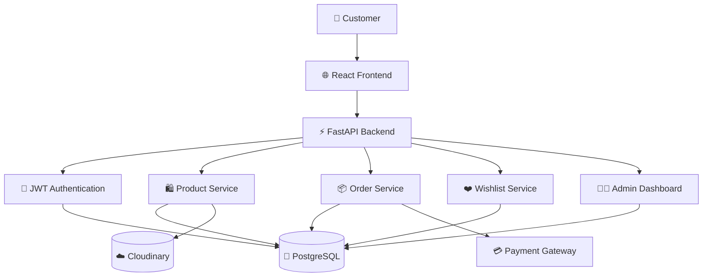
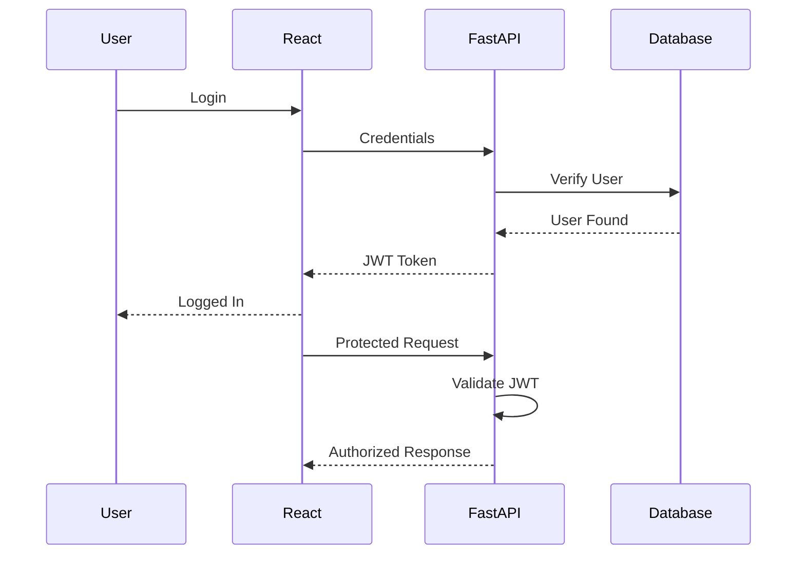
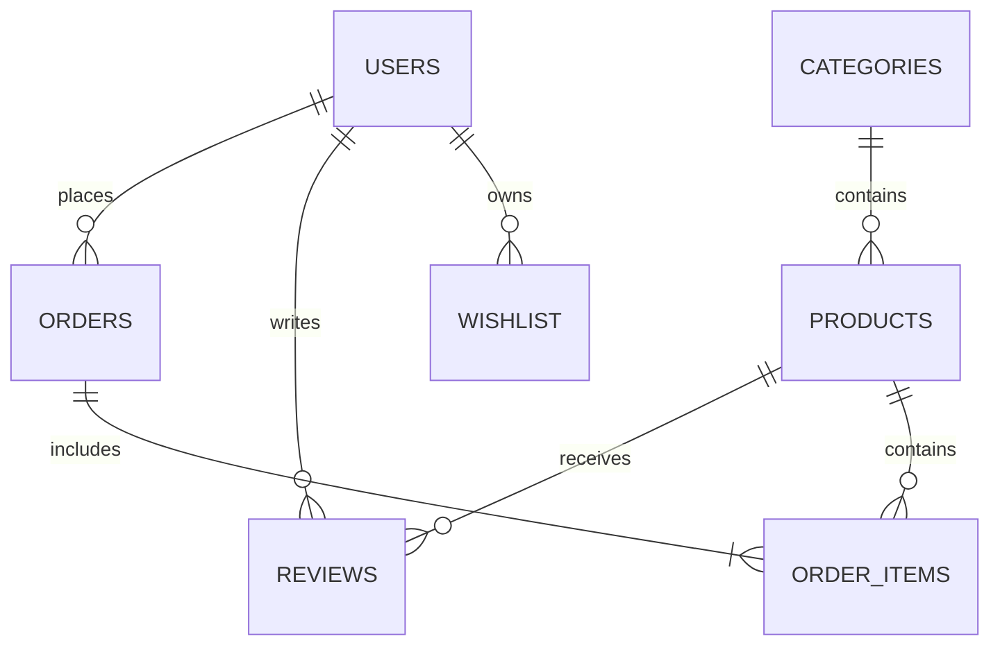

---

# 📂 Proposed Folder Structure

```
Aab-e-Hayat

│

├── frontend
│   ├── public
│   ├── src
│   │
│   ├── assets
│   ├── components
│   │     ├── Navbar
│   │     ├── Footer
│   │     ├── Hero
│   │     ├── ProductCard
│   │     ├── SearchBar
│   │     ├── Cart
│   │     ├── Wishlist
│   │     └── UI
│   │
│   ├── pages
│   │     ├── Home
│   │     ├── Products
│   │     ├── ProductDetails
│   │     ├── Cart
│   │     ├── Wishlist
│   │     ├── Checkout
│   │     ├── Login
│   │     ├── Register
│   │     ├── Orders
│   │     ├── Profile
│   │     └── Admin
│   │
│   ├── hooks
│   ├── services
│   ├── context
│   ├── routes
│   ├── utils
│   └── styles
│
├── backend
│
│   ├── app
│   │
│   ├── api
│   ├── auth
│   ├── config
│   ├── middleware
│   ├── models
│   ├── schemas
│   ├── services
│   ├── routes
│   ├── database
│   ├── utils
│   └── main.py
│
├── docs
├── screenshots
├── database
├── tests
├── README.md
└── LICENSE
```

---

# 🔐 Authentication Flow



---

# 🗄️ Database Overview

The application follows a relational database architecture using **PostgreSQL**.

### Main Tables

- Users
- Products
- Categories
- Orders
- Order Items
- Reviews
- Wishlist
- Cart
- Coupons
- Payments
- Addresses
- Admin Logs

---

## 📊 Entity Relationship Diagram



---

# 📡 REST API Structure

```
/api

├── auth
│      ├── register
│      ├── login
│      ├── logout
│      ├── refresh-token
│
├── users
│
├── profile
│
├── products
│
├── categories
│
├── wishlist
│
├── cart
│
├── orders
│
├── payments
│
├── coupons
│
├── reviews
│
└── admin
```

---

# 🌐 API Endpoints (Planned)

| Method | Endpoint | Description |
|---------|----------|-------------|
| POST | /auth/register | Register User |
| POST | /auth/login | Login User |
| GET | /products | Get Products |
| GET | /products/{id} | Product Details |
| POST | /cart | Add to Cart |
| GET | /cart | View Cart |
| POST | /wishlist | Add Wishlist |
| POST | /orders | Create Order |
| GET | /orders | User Orders |
| POST | /reviews | Submit Review |

---

# 🔒 Security Features

The project is designed with security as a priority.

### Authentication

- JWT Authentication
- Refresh Tokens
- Secure Password Hashing
- Protected Routes

### API Security

- Input Validation
- Pydantic Schemas
- Request Validation
- Error Handling

### Database

- SQLAlchemy ORM
- Parameterized Queries
- Transaction Management

### Frontend

- Secure Token Storage
- Route Guards
- Form Validation

---

# ⚙️ Environment Variables

Create a `.env` file inside the backend folder.

```env
DATABASE_URL=

SECRET_KEY=

ALGORITHM=HS256

ACCESS_TOKEN_EXPIRE_MINUTES=30

CLOUDINARY_NAME=

CLOUDINARY_API_KEY=

CLOUDINARY_API_SECRET=

RAZORPAY_KEY_ID=

RAZORPAY_SECRET=

EMAIL_HOST=

EMAIL_PORT=

EMAIL_USERNAME=

EMAIL_PASSWORD=
```

---

# 📦 Backend Dependencies

```
FastAPI

SQLAlchemy

Pydantic

Alembic

Uvicorn

psycopg2

python-jose

passlib

bcrypt

python-dotenv

Cloudinary
```

---

# 💻 Frontend Dependencies

```
React

React Router

Tailwind CSS

Axios

React Hook Form

Framer Motion

React Icons

React Toastify
```

---

# 🧩 Planned Backend Modules

- Authentication
- Product Management
- Inventory Management
- Order Management
- Payment Module
- Wishlist Module
- Coupon System
- Email Service
- Analytics
- Admin Controls

---

# 🎨 UI Components

- Navigation Bar
- Hero Banner
- Featured Products
- Category Cards
- Product Grid
- Product Details
- Shopping Cart
- Wishlist
- Checkout
- Footer
- Admin Dashboard
- Analytics Cards

---

# 📸 Project Preview

> Screenshots will be added as development progresses.

```
Landing Page

Collection Page

Product Details

Shopping Cart

Checkout

User Dashboard

Admin Dashboard

Analytics

Mobile View
```

---

# 🚀 Installation Guide

```

➡️ Continue in **README Part 3**

```
